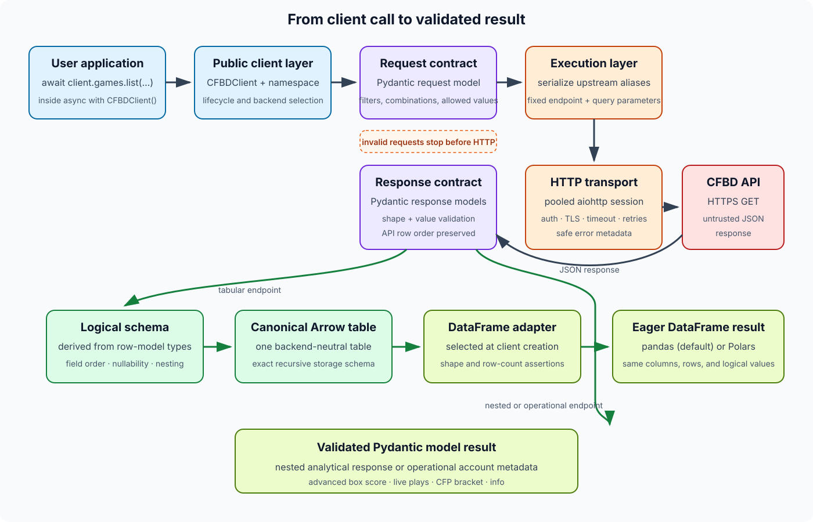

# Request lifecycle architecture

A call such as `await client.games.list(year=2024, team="Michigan")` crosses
several deliberately separate layers. The public namespace describes the
operation, Pydantic owns both external contracts, the transport owns network
behavior, and presentation happens only after the response is valid.



## How to read the flow

1. **The public client selects behavior.** `CFBDClient` owns the configured
   backend and one context-managed HTTP session. Its typed namespaces expose
   the supported endpoint methods.
2. **The request contract fails early.** A method accepts either its Pydantic
   request model or keyword filters. It rejects mixed styles, unknown fields,
   invalid allowed values, and invalid selector combinations before HTTP.
3. **The executor and transport isolate I/O.** The executor serializes validated
   fields using the upstream query aliases. The transport adds bearer
   authentication and applies TLS verification, per-attempt timeouts, bounded
   retries, and deterministic session ownership.
4. **The response contract validates untrusted JSON.** The endpoint's Pydantic
   response model verifies the returned shape and values. Malformed upstream
   data raises a response-validation error instead of reaching presentation.
5. **The endpoint chooses one result path.** Tabular responses use the response
   model annotations as their logical schema, build one canonical Arrow table,
   and materialize the selected eager pandas or Polars DataFrame. Irreducibly
   nested analytical responses and operational account metadata return their
   validated Pydantic model directly.

When a `RetrievalObserver` is configured, the executor correlates this validated
retrieval with cache decisions and the transport's individual HTTP attempts.
See [ADR 0005](0005-client-retrieval-observability.md) for the bounded event and
failure-isolation contract.

Backend selection therefore changes only the final DataFrame adapter. It does
not change endpoint names, request validation, HTTP behavior, response models,
the canonical schema, row order, or logical values.

```{seealso}
- [Requests and allowed values](../guides/requests.md) for request-model rules.
- [Results and DataFrames](../guides/results.md) for the two result paths.
- [Errors and retries](../guides/errors-and-retries.md) for layer-specific
  failures and retry behavior.
```
