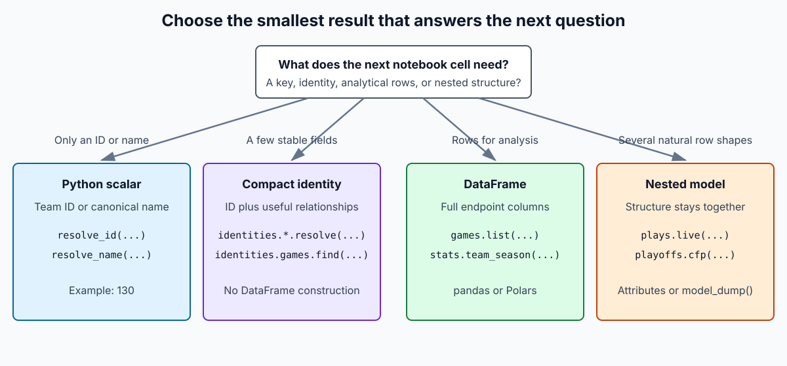
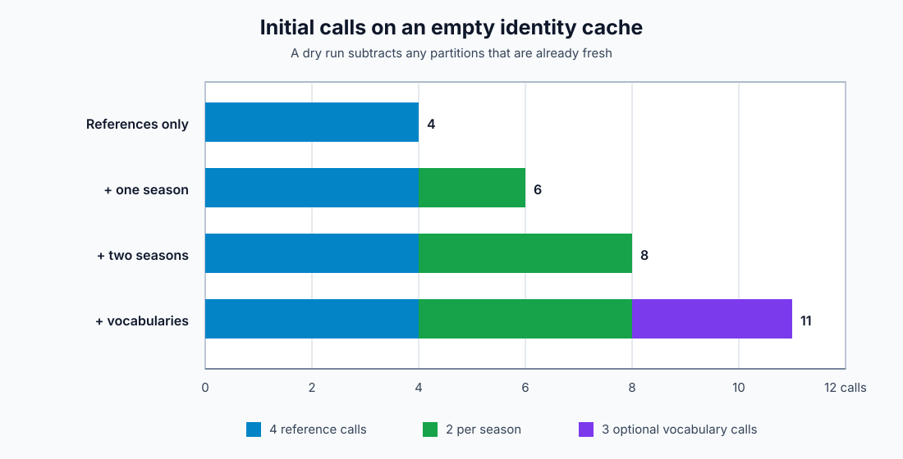
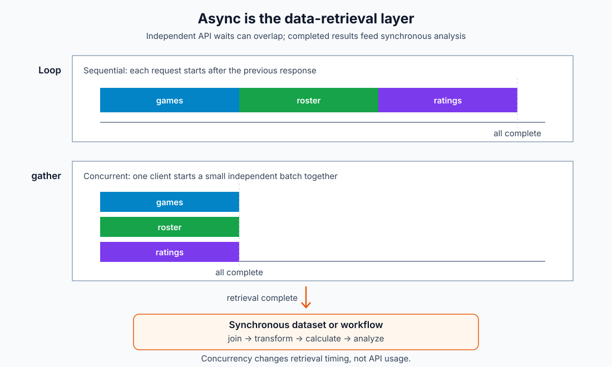

# Common notebook recipes

This guide starts with the questions people commonly ask in a notebook: find
an ID, fetch a season, compare ratings, inspect a player, reuse cached data, or
gather several independent results at once.

The examples use top-level `await`, which works in Jupyter and IPython. A normal
Python script puts the same code inside `async def main()` and calls
`asyncio.run(main())`, as shown in [Getting started](../getting-started.md).

## Set up one reusable cache configuration

SQLite makes notebook reruns reuse validated responses without another service:

```python
from cfb_data import CFBDClient, FreshnessMode, SQLiteCacheConfig

cache = SQLiteCacheConfig()
```

Each example opens a client for the related calls in that cell. The SQLite
cache remains available after the client closes.

## Choose the result you actually need



There are three useful result sizes:

| You need... | Use... | You receive... |
| --- | --- | --- |
| A team ID or canonical team name | `client.identities.teams.resolve_id()` or `.resolve_name()` | One Python scalar |
| A few stable identity fields | `client.identities.*.resolve()` or `games.find()` | A compact Pydantic identity model |
| Rows and columns for analysis | A subject endpoint such as `games.list()` or `stats.team_season()` | A pandas or Polars DataFrame |
| A naturally nested result | Methods such as `plays.live()` or `playoffs.cfp()` | A Pydantic model |

Compact identity methods avoid building a DataFrame, but they do not guarantee
that the upstream API sends less data. For example, resolving a team may fetch
the team reference endpoint. Choose identities when your Python code only
needs stable keys; choose an endpoint DataFrame when you need analytical
columns.

The client does not expose raw JSON. In this guide, a “full result” means all
validated fields returned by the public endpoint, represented as a DataFrame or
one of the documented nested models.

## Find a team ID, name, or full team row

### Only the provider ID

```python
async with CFBDClient(cache=cache) as client:
    team_id = await client.identities.teams.resolve_id("MICH")

team_id
```

The result is an `int`, such as `130`. The query can be a provider ID,
canonical school name, abbreviation, or known alternate name.

### A compact identity

```python
async with CFBDClient(cache=cache) as client:
    team = await client.identities.teams.resolve("Michigan")

team
```

`TeamIdentity` contains the stable ID, school name, abbreviation, and known
alternate names. It does not contain every field from the Teams endpoint.

### Full team rows

Use the endpoint when you also need mascot, colors, logos, conference, or
location:

```python
async with CFBDClient(cache=cache) as client:
    teams = await client.teams.fbs(year=2024)

michigan = teams.loc[teams["id"].eq(team_id)]
display(michigan)
```

If you fetch the DataFrame first, that response also enriches the identity
catalog. You can then resolve from local data without another API call:

```python
async with CFBDClient(cache=cache) as client:
    teams = await client.teams.fbs(year=2024)
    team_id = await client.identities.teams.resolve_id(
        "MICH",
        freshness=FreshnessMode.local_only,
    )
```

Conference and venue resolvers return compact models; read their `.id` fields:

```python
async with CFBDClient(cache=cache) as client:
    conference = await client.identities.conferences.resolve("B1G")
    venue = await client.identities.venues.resolve("Michigan Stadium")

conference.id, conference.name, venue.id, venue.name
```

## Find game IDs or full game rows

### IDs and compact relationships

`games.find()` returns compact `GameIdentity` models with fields such as game
ID, season, week, start time, team IDs, and venue ID:

```python
async with CFBDClient(cache=cache) as client:
    game_refs = await client.identities.games.find(
        season=2024,
        team="Michigan",
    )

game_ids = [game.id for game in game_refs]
game_ids[:5]
```

Use this when another endpoint needs `game_id` and you do not need scores or
the full schedule columns in the current step.

### Schedule, results, scores, and IDs together

```python
async with CFBDClient(cache=cache) as client:
    games = await client.games.list(year=2024, team="Michigan")

columns = [
    "id",
    "week",
    "start_date",
    "home_team",
    "away_team",
    "home_points",
    "away_points",
]
display(games[columns].head())
```

The `id` column is the CFBD game ID. If the full games frame is already in the
notebook, take IDs from that column instead of making a separate identity call.

Starting from one known ID, fetch its complete game row with:

```python
async with CFBDClient(cache=cache) as client:
    game = await client.games.list(game_id=401628347)
```

## Find a player ID or player data

An athlete name may not be unique, so include a team and season when possible.

### Compact player identity

```python
async with CFBDClient(cache=cache) as client:
    athlete = await client.identities.athletes.resolve(
        name="Donovan Edwards",
        team="Michigan",
        season=2024,
    )

athlete.id, athlete.name, athlete.position
```

With a season, the resolver uses the matching roster partition. Without a
season, it uses player search and may need more scope when names collide.

### Search details or a full roster

```python
async with CFBDClient(cache=cache) as client:
    matches = await client.players.search(
        search_term="Donovan Edwards",
        year=2024,
        team="Michigan",
    )
    roster = await client.teams.roster(year=2024, team="Michigan")

display(matches.head())
display(roster[["id", "first_name", "last_name", "position", "jersey"]].head())
```

Use player search for matching biographical and team-stint details. Use the
roster when the notebook needs every player from one team-season.

## Fetch common analytical data

The table below maps common questions to the method that returns the right row
shape. “One row represents” is sometimes called the *grain* of a dataset.

| Question | Method | One row represents |
| --- | --- | --- |
| What games did a team play? | `client.games.list(year=..., team=...)` | One game |
| What was each team's season record? | `client.games.records(year=..., team=...)` | One team-season record |
| Who was on the roster? | `client.teams.roster(year=..., team=...)` | One athlete on a roster |
| What basic stats did a team record? | `client.stats.team_season(year=..., team=...)` | One team/statistic pair |
| What stats did each player record? | `client.stats.player_season(year=..., team=...)` | One player/statistic pair |
| What were the advanced team metrics? | `client.stats.advanced_season(year=..., team=...)` | One team-season |
| What was a team's Elo or SP+ rating? | `client.ratings.elo(...)` or `.sp(...)` | One team-season rating |
| What was a team's predicted points added? | `client.metrics.team_season_ppa(...)` | One team-season PPA result |
| What happened on each play? | `client.plays.list(year=..., week=..., team=...)` | One play |
| How did each drive end? | `client.drives.list(year=..., team=...)` | One drive |
| What did the CFP poll look like? | `client.rankings.list(year=..., poll="cfp", latest=True)` | One poll-week with nested ranks |
| What betting lines were available? | `client.betting.lines(year=..., team=...)` | One game with nested provider lines |
| How many API calls remain? | `client.info.account()` | One account model |

For a compact team-season notebook, fetch several related tables within one
client context:

```python
async with CFBDClient(cache=cache) as client:
    games = await client.games.list(year=2024, team="Michigan")
    record = await client.games.records(year=2024, team="Michigan")
    team_stats = await client.stats.team_season(year=2024, team="Michigan")
    elo = await client.ratings.elo(year=2024, team="Michigan")
    ppa = await client.metrics.team_season_ppa(year=2024, team="Michigan")
```

These results have different row shapes, so inspect each before joining:

```python
for name, frame in {
    "games": games,
    "record": record,
    "team_stats": team_stats,
    "elo": elo,
    "ppa": ppa,
}.items():
    print(name, frame.shape, frame.columns.tolist())
```

## Hydrate only the identity data you need

Hydration is optional. A normal endpoint call or identity lookup already adds
facts to the catalog. Use hydration when you want a reusable reference catalog
before a group of notebooks or before working from cached data.



On an empty cache, the initial plans are:

| Goal | Arguments | Initial calls |
| --- | --- | ---: |
| Teams, venues, conferences, and affiliations | `seasons=[]` | 4 |
| Reference data plus games and rosters for one season | `seasons=[2024]` | 6 |
| Reference data plus two seasons | `seasons=[2023, 2024]` | 8 |
| Two seasons plus play/stat vocabularies | add `include_vocabularies=True` | 11 |

Fresh coverage is skipped, so a resumed plan may contain fewer calls or none.
Use `dry_run=True` to see the actual remaining work:

```python
hydrate_options = {
    "seasons": [2024],
    "classification": "fbs",
    "include_vocabularies": False,
}

async with CFBDClient(cache=cache) as client:
    plan = await client.identities.hydrate(
        **hydrate_options,
        dry_run=True,
    )

plan.planned_calls, plan.endpoints
```

Run the same plan without `dry_run` when it looks right:

```python
async with CFBDClient(cache=cache) as client:
    completed = await client.identities.hydrate(
        **hydrate_options,
        max_concurrency=3,
    )

completed.completed_calls
```

Choose the smallest useful scope:

- For one or two IDs, call the resolver directly; do not hydrate first.
- For team, conference, and venue reference data, use `seasons=[]`.
- Add only the seasons whose games and rosters the notebooks will use.
- Use `classification="fbs"` when the work is FBS-only.
- Add vocabularies only when play types, play-stat types, or team-stat category
  names are needed locally.

Hydration requires SQLite or Redis because it is designed to save progress.
See [Advanced cache and identity behavior](../advanced/cache-behavior.md) for
the exact partitions, freshness rules, and resume behavior.

## Gather independent results concurrently

The client is async because its job is gathering and validating data, not
performing analytical calculations. When several endpoint calls are
independent, Python can overlap the time spent waiting for their responses.

DataFrame calculations sit on the other side of that boundary. Gather the
endpoint results with the async client, then pass the completed pandas or
Polars frames into ordinary synchronous analysis—or, as those features are
added, into cfb-data's synchronous dataset and workflow layers.



### Use a loop when calls depend on each other

A sequential loop fits calls that must happen in order:

```python
seasons = [2022, 2023, 2024]
games_by_season = {}

async with CFBDClient(cache=cache) as client:
    for season in seasons:
        games_by_season[season] = await client.games.list(
            year=season,
            team="Michigan",
        )
```

Use the same pattern when one call supplies the ID for the next call.

### Use `asyncio.gather()` for a small known batch

These requests are independent, so they can wait on the API at the same time:

```python
import asyncio

async with CFBDClient(cache=cache) as client:
    games, roster, elo = await asyncio.gather(
        client.games.list(year=2024, team="Michigan"),
        client.teams.roster(year=2024, team="Michigan"),
        client.ratings.elo(year=2024, team="Michigan"),
    )
```

`gather()` returns results in the same order as the awaitables passed to it.
Concurrent calls still count individually against the API's limits.

### Use a small worker queue for a larger list

A queue lets a fixed number of workers share many independent requests. This
example allows three seasons in flight at once:

```python
import asyncio

seasons = list(range(2015, 2025))
worker_count = 3
queue: asyncio.Queue[int | None] = asyncio.Queue()
games_by_season = {}

for season in seasons:
    queue.put_nowait(season)
for _ in range(worker_count):
    queue.put_nowait(None)


async def worker(client: CFBDClient) -> None:
    while True:
        season = await queue.get()
        if season is None:
            return
        games_by_season[season] = await client.games.list(
            year=season,
            team="Michigan",
        )


async with CFBDClient(cache=cache) as client:
    async with asyncio.TaskGroup() as tasks:
        for _ in range(worker_count):
            tasks.create_task(worker(client))
```

`worker_count` is the maximum number of calls in flight in this example; set it
to fit the available API limit and the size of the retrieval job. Identity
hydration already exposes this control as `max_concurrency`, so it does not
need a separate queue.

## Join related endpoint results

Prefer stable provider IDs when both results contain them. Games and betting
lines both use the game ID in their `id` column:

```python
async with CFBDClient(cache=cache) as client:
    games = await client.games.list(year=2024, team="Michigan")
    betting = await client.betting.lines(year=2024, team="Michigan")

game_lines = games.merge(
    betting[["id", "lines"]],
    on="id",
    how="left",
    validate="one_to_one",
)
```

`validate="one_to_one"` makes pandas raise if either side unexpectedly has
duplicate game IDs. Before any join, identify what one row represents on both
sides and confirm the key columns are unique at that level.

## Check account access and remaining calls

Account information is a model rather than a DataFrame:

```python
async with CFBDClient() as client:
    account = await client.info.account()

print(account.tier_name)
print(account.remaining_calls, account.reset_at)
print(account.features.model_dump())
```

This is useful before a larger notebook run or when an endpoint returns an
authorization error. Account and usage responses are not cached.

## Continue learning

- [Work with results](results.md) explains nested columns and ordinary pandas
  and Polars operations.
- [Cache responses and look up identities](cache-and-identities.md) explains
  SQLite, local Redis, cache modes, and lookup troubleshooting.
- [Endpoint reference](../cfbd_api/README.md) lists every method and filter.
- [Advanced details](../advanced/index.md) collects exact dtypes, enum values,
  cache behavior, and retry settings.
